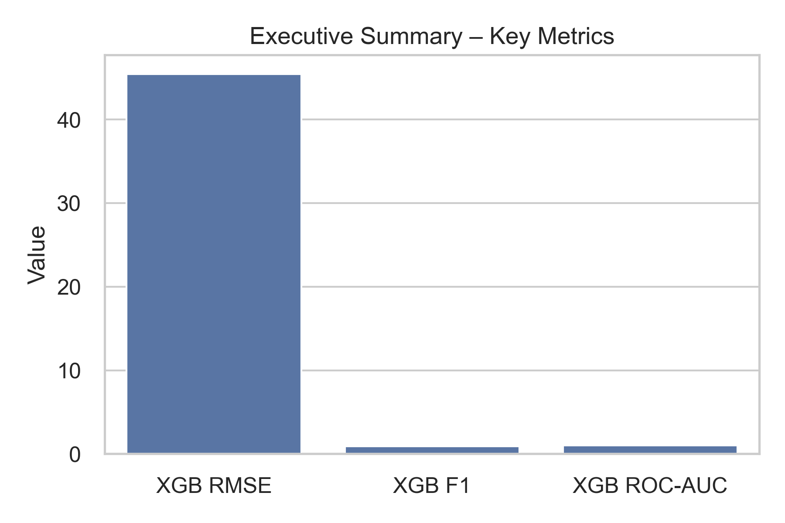
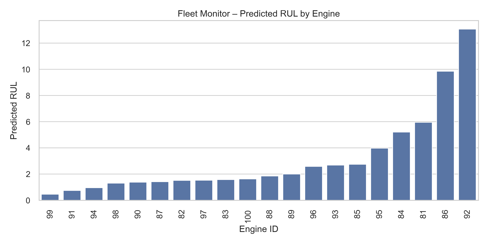
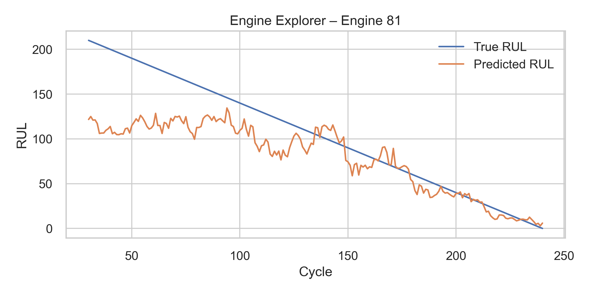
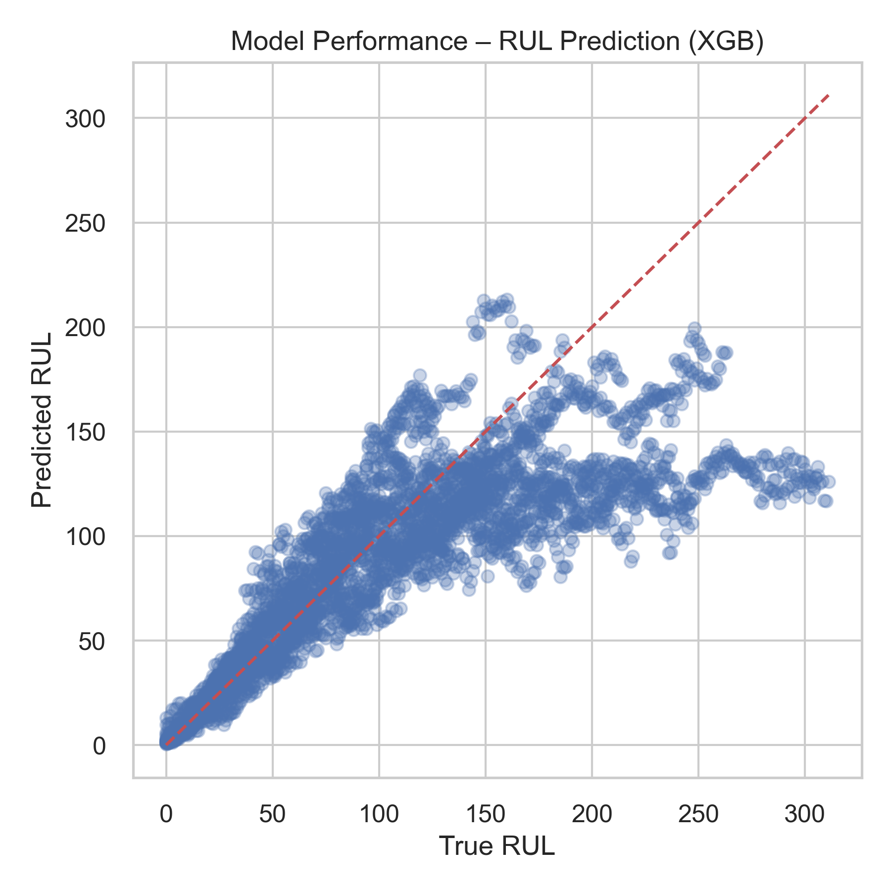
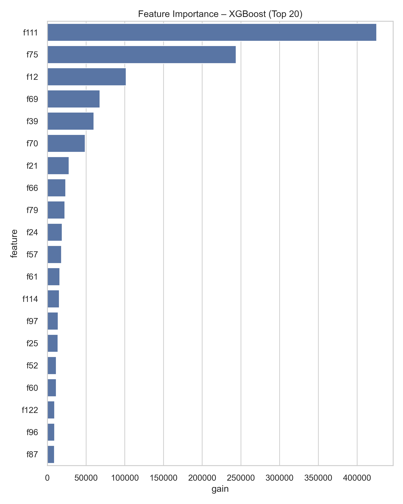

# 🔧 Predictive Maintenance of Turbofan Engines (NASA C-MAPSS FD001)

## 📘 Project Overview
This repository implements an **end-to-end predictive maintenance solution** using the NASA **C-MAPSS FD001** turbofan engine dataset.

The goal is to:
- Predict **Remaining Useful Life (RUL)**
- Predict **failure risk** (within next X cycles)
- Provide a **monitoring dashboard** for industrial operations

The project includes:
- Full **data processing pipeline**
- **Feature engineering** (rolling statistics, slopes, FFT, etc.)
- **Regression & classification models**
- **Time-based train/validation/test split**
- **Streamlit dashboard** for real-time visualization

This project represents a practical predictive maintenance workflow used in **manufacturing**, **aerospace**, and **industrial IoT (Industrie 4.0)**.

---

## 📊 Business Motivation
Unexpected machine failures cause:
- Production downtime  
- Lost revenue  
- Emergency repairs  
- Reduced equipment lifetime  

Predictive maintenance:
- Reduces unplanned downtime  
- Enables scheduled maintenance  
- Improves operational efficiency  
- Extends machine lifetime  

---

## 📁 Project Structure

```text
project/
│
├── data/
│   ├── raw/
│   ├── interim/
│   └── processed/
│
├── models/
│
├── src/
│   ├── data_loading.py
│   ├── make_features.py
│   ├── train_models.py
│   ├── evaluate.py
│   ├── utils.py
│   ├── run_train_models.py
│   └── run_evaluate.py
│
├── notebooks/
│
├── dashboard/
│   └── app.py
│
├── test_features.csv
└── README.md
```

---

## 🧠 Methodology

### 1. Data Loading
- NASA C-MAPSS FD001 dataset  
- 100 engines, 21 sensors, 3 operating settings  
- RUL computed as countdown from last cycle  

### 2. Feature Engineering
Techniques used:
- Rolling means / stds  
- Rolling slopes (degradation trends)  
- Sensor deltas  
- FFT-based frequency features  
- Multi-sensor fusion  
- Label generation (RUL + failure horizon)  

### 3. Label Types
- **Regression:** Remaining Useful Life  
- **Classification:** Failure within next *H* cycles  

### 4. Splits
- **Time-based** (train → val → test)  
- Ensures realistic performance estimation  

### 5. Models
- **XGBoost Regressor** (main RUL model)  
- **XGBoost Classifier** (failure model)  
- Baselines:  
  - Linear Regression  
  - Logistic Regression  

### 6. Evaluation

#### Regression:
- RMSE  
- MAE  
- RUL prediction scatter plots  

#### Classification:
- Accuracy  
- Precision  
- Recall  
- F1  
- ROC-AUC  
- Confusion matrix  

---

## 📈 Results (Test Set)

| Metric | Value |
|--------|--------|
| **XGB RUL RMSE** | **45.43 cycles** |
| **XGB Accuracy** | **0.9711** |
| **XGB F1-score** | **0.9122** |
| **XGB ROC-AUC** | **0.9944** |
| **LogReg ROC-AUC** | **0.9892** |

The XGBoost models deliver **strong RUL accuracy** and **excellent failure classification**.

---

# 🖥 Dashboard Demo

Below are recommended screenshot placeholders for a complete portfolio showcase.

## 📌 Screenshot 1 — Executive Summary



Shows:
- High-level metrics  
- Business insight panel  
- Quick overview of model performance  

---

## 📌 Screenshot 2 — Fleet Monitor




Shows:
- Current risk level per engine  
- RUL bar chart  
- Engine table sorted by risk  

---

## 📌 Screenshot 3 — Engine Explorer




Shows:
- True vs predicted RUL over cycles  
- Rolling feature visualizations  
- Engine degradation trend  

---

## 📌 Screenshot 4 — Model Performance



Shows:
- Regression scatter plot (true vs predicted)  
- Confusion matrix  

---

## 📌 Screenshot 5 — Feature Importance




Shows:
- Top XGBoost features  
- Gain-based importance plot  

---

# 🚀 How to Run the Full Pipeline

### Install dependencies
```bash
pip install -r requirements.txt
```

### 1. Generate features
```bash
python -m src.run_make_features
```

### 2. Train all models
```bash
python -m src.run_train_models
```

### 3. Evaluate models
```bash
python -m src.run_evaluate
```

### 4. Launch dashboard
```bash
cd dashboard
python -m streamlit run app.py
```

---

## 📎 Technologies Used
- Python  
- Pandas, NumPy  
- Scikit-Learn  
- XGBoost  
- SciPy  
- Streamlit  
- Matplotlib / Seaborn  

---

## 🎉 Credits
NASA’s C-MAPSS dataset — standard benchmark for prognostics & health management.
